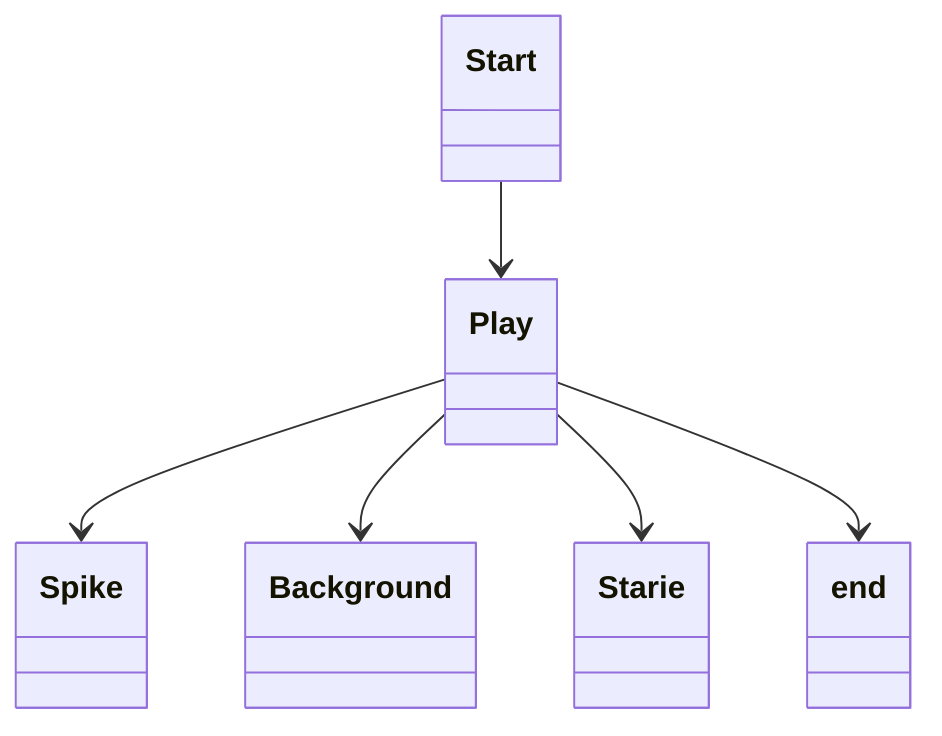
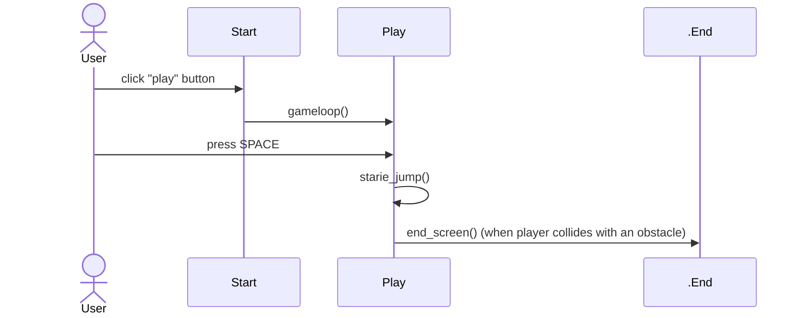

# Luokkakaavio

```mermaid
  classDiagram
      Start --> Play
      Play --> Spike
      Play --> Background
      Play --> Starie
      Play --> end   
```
# Sekvenssikaavio pelin kulusta

```mermaid
  sequenceDiagram
    actor User
    participant Start
    participant Play
    participant .End
    User->>Start: click "play" button
    Start->>Play: gameloop()
    User->>Play: press SPACE
    Play->>Play: starie_jump()
    Play->>.End: end_screen() (when player collides with an obstacle)
```
