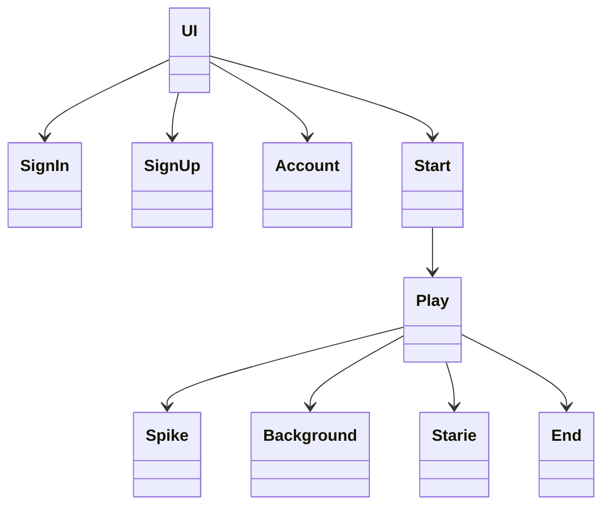
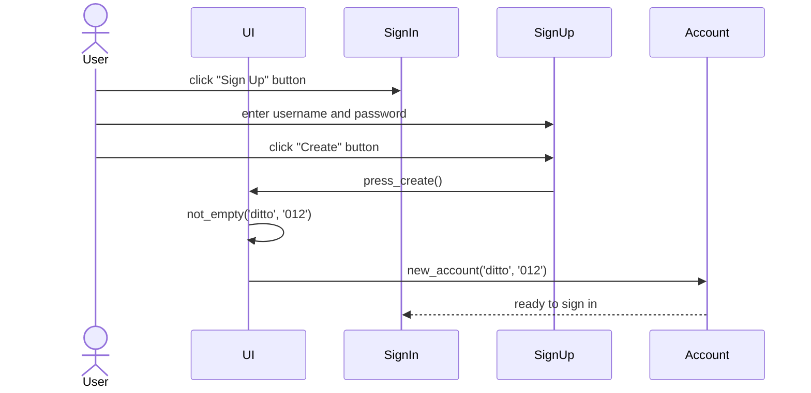
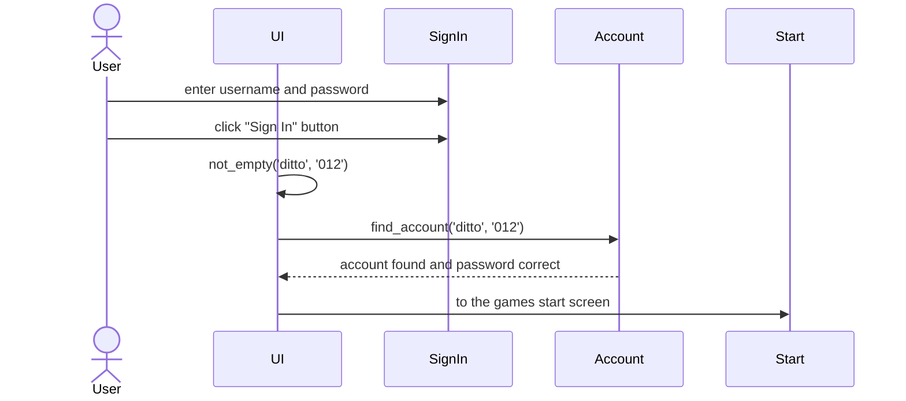
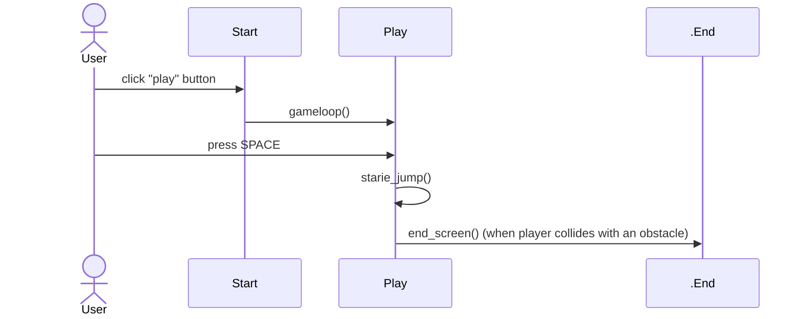

# Arkkitehtuurikuvaus

## Käyttöliittymä
Sovelluksessa on viisi näkymää:
- sisäänkirjautuminen
- uuden käyttäjän luominen
- pelin aloitusruutu
- pelin pelaaminen
- game over

## Luokkakaavio

## Sekvenssikaavio uuden käyttäjän luomisesta

## Sekvenssikaavio sisäänkirjautumisesta

## Sekvenssikaavio pelin kulusta

## Tietojen tallentaminen
Käyttäjien kirjautumistiedot tallennetaan pysyvästi `accounts.db`-nimiseen SQLite-tietokantaan `accounts.py`-tiedoston `Account`-luokassa.
