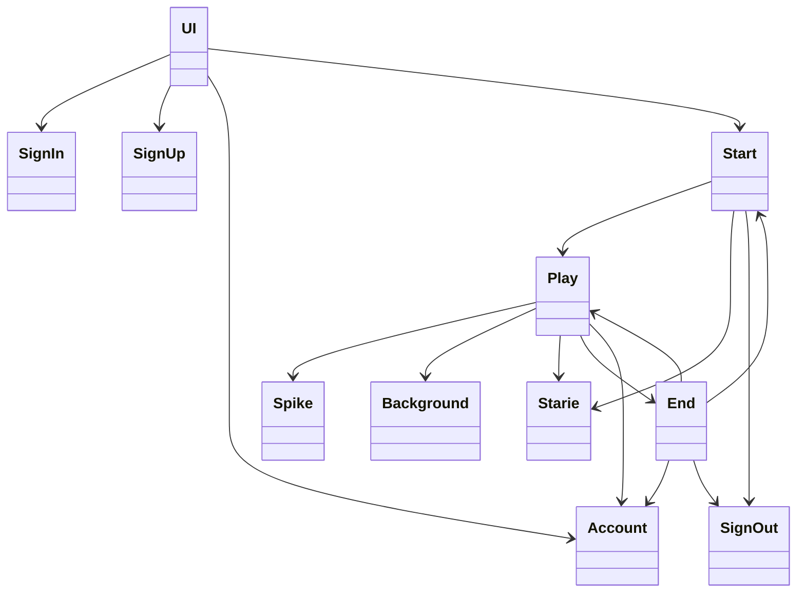
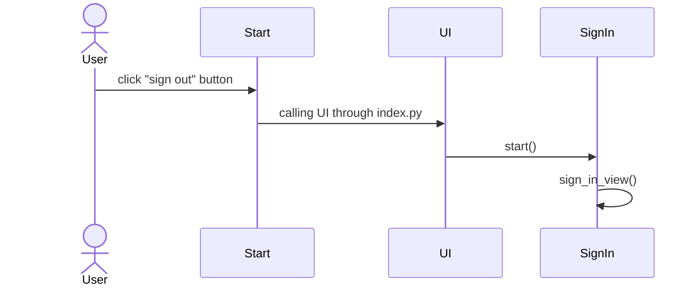

# Arkkitehtuurikuvaus

## Käyttöliittymä
Sovelluksessa on viisi näkymää:
- sisäänkirjautumisnäkymä
- uuden käyttäjän luomisnäkymä
- pelin aloitusnäkymä
- pelin pelaamisnäkymä
- game over -näkymä

## Luokkakaavio

## Sekvenssikaavio uuden käyttäjän luomisesta

## Sekvenssikaavio sisäänkirjautumisesta

## Sekvenssikaavio pelin kulusta

## Sekvenssikaavio uloskirjautumisesta

Toinen tapa uloskirjautumiseen on painaa "sign out" -nappia *Game Over* -näkymässä, jolloin sekvenssikaavio on muuten sama paitsi kaaviossa olevan Start-luokan tilalla olisi End-luokka.
## Tietojen tallentaminen
Käyttäjien kirjautumistiedot ja ennätyspisteet tallennetaan pysyvästi `accounts.db`-nimiseen SQLite-tietokantaan `accounts.py`-tiedoston `Account`-luokassa.
