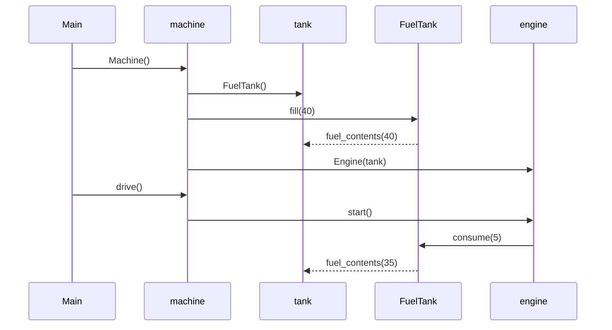

```mermaid
  sequenceDiagram
      participant Main
      participant machine
      participant tank
      participant FuelTank
      participant engine
      Main ->> machine: Machine()
      machine ->> tank: FuelTank()
      machine ->> FuelTank: fill(40)
      FuelTank -->> tank: fuel_contents(40)
      machine ->> engine: Engine(tank)
      Main ->> machine: drive()
      machine ->> engine: start()
      engine ->> FuelTank: consume(5)
      FuelTank -->> tank: fuel_contents(35)
```
